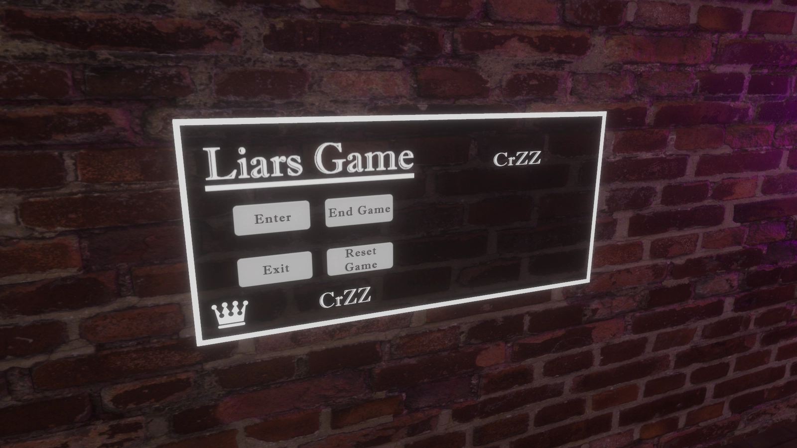

# VRC-LiarsGame

Liars Game is a minigame developed in Unity using c# and UdonSharp to be played inside VrChat.

The world to check the minigame can be found [here](https://vrchat.com/home/world/wrld_71147554-d41a-4738-8c28-3e76715fce84)

Available on [Booth](https://booth.pm/en/items/6713975) & [Jinxxy](https://jinxxy.com/CrZ3d/products/LiarsGame)

## How It Works?

The player interacts with the menu to enter the game. Once inside, they can choose their preferred side at the table by interacting with one of the four buttons. After selecting a button, its text will change from "Not Ready" to "Ready", indicating that the player is prepared to start. The game will only begin once all players are ready, with a minimum of two players and a maximum of four. The number of cards dealt will adjust dynamically based on the number of players in the game.

After the game starts, players can choose a card to play by interacting with their hand. To call out a bluff, players interact with the shuffled cards in the center of the table. When a bluff is called, the last played card is revealed. If the player who played the card was lying, they must interact with the revolver, facing a 50% chance of losing (being eliminated) or continuing to play. However, if the player was telling the truth, the one who called the bluff must interact with the revolver instead, risking elimination.

The game ends when a player successfully plays all their cards or is the last one standing. It’s important to note that every interaction in the game whether playing a card, calling a bluff, or interacting with the revolver is accompanied by its own unique animation and sound , adding to the immersive and thrilling atmosphere of the experience.

## Install instructions:

- Is required the latest version of the VRCSDK3 and UdonSharp.
- TextMmeshPro (If you do not have TMP it will ask you to install when draging the prefab)

## Terms of use:

- You CAN use this minigame in any of your worlds.
- You CAN'T send or sell this asset to others.
- You only CAN use this asset in a world sold as a package if you purchase the distributable version instead of the other versions.
